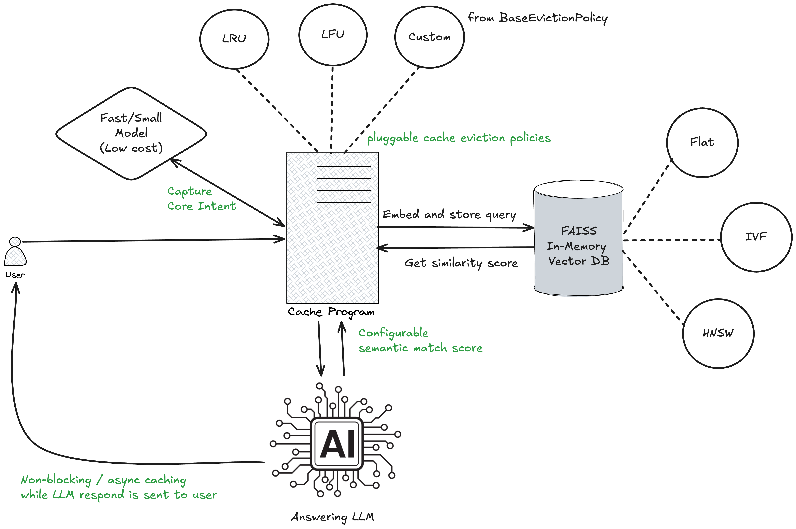
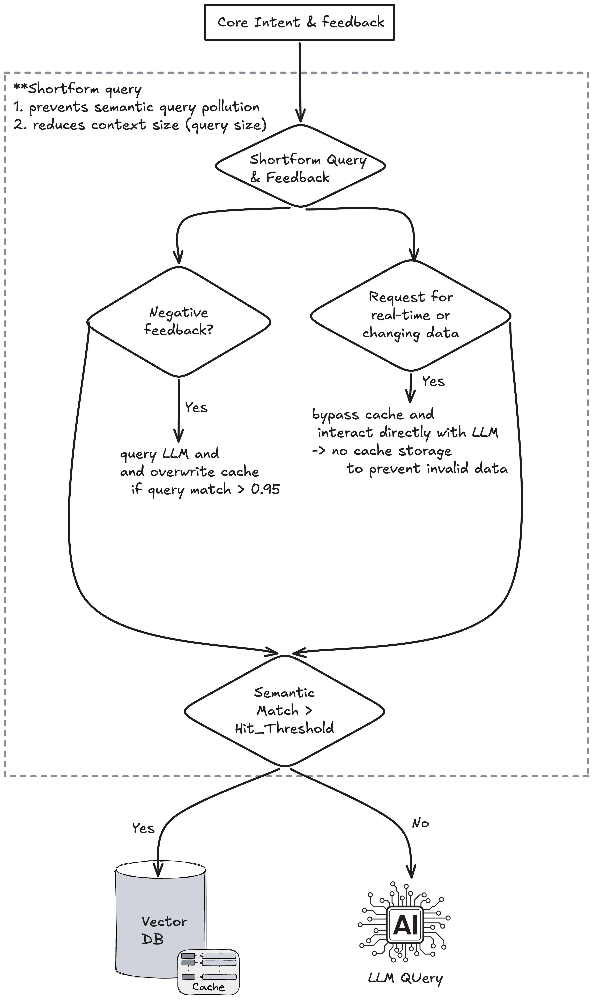

# Semantic Cache

> **Configurable, Thread-Safe, Self-Hosted and Completely Private**

### Features:

* **In-Memory FAISS Vector Layer:** Uses native C++ memory allocation for fast, zero-cost, sub-millisecond similarity lookups directly within your local RAM. 

* **Flexible Indexing Topologies:** Supports dynamic index switching among `Flat` (exact/brute-force distance), `IVF` (inverted-file cell clustering), and `HNSW` (hierarchical proximity graphs) depending on data scale and search latency needs. 

* **Intent-Driven Query Pre-Processing:** Uses small, high-throughput LLMs to intercept and process incoming user prompts before hitting the vector database. 

* **Negative Feedback Capture:** Detects negative user corrections (e.g., *"That's not my project"*) to refine search parameters or apply negative token weights. 

* **Core Intent Extraction:** Strips out conversational fluff to isolate explicit entities, target skills, and primary technologies. 

* **Temporal & Real-Time Detection:** Flags questions requesting current events or live data, automatically bypassing vector cache records to trigger a fresh LLM query. 

* **Non-Blocking Asynchronous Caching:** Implements an async read/write cache loop that processes embedding updates concurrently without blocking the main runtime or UI. 

* **Pluggable Cache Eviction Policies:** Ships with out-of-the-box `LRU` (Least Recently Used) and `LFU` (Least Frequently Used) strategies, with an abstract `BaseCacheEvictionPolicy` class for easy custom extensions.

* **Thread-Safe Eviction Policies:** Ships with strictly O(1) `LRUPolicy` and `LFUPolicy` engines, guarded by re-entrant locks for safe multi-threaded throughput.

* **Telemetry via Loguru:** Integrates structured, thread-safe `loguru` logging to track pipeline execution, catch web-scraping failures, and analyze the real-time cache hit ratio. 

* **Privacy-First Ephemeral Storage:** Since all scraping data and FAISS indexes reside strictly in volatile RAM, no Personally Identifiable Information (PII) is ever written to disk or sent to a third-party server.

### Architecture

<br>

<div align="center">
  
  <p><i>Figure 1: Architectural / Design Overview</i></p>
</div>

<br>

<div align="center">
  
  <p><i>Figure 2: Caching - Query Shortform & Feedback Workflow</i></p>
</div>

<br>

### External Semantic Cache vs Provider API Cache

| Feature | Provider API Caching <br> *(Prompt / Context Caching)* | External Application Caching <br> *(Local FAISS Vector Layer)* |
| :--- | :--- | :--- |
| **System Placement** | **Remote:** Resides on the LLM provider’s GPU cluster infrastructure. | **Local:** Resides directly in your application container's volatile RAM. |
| **Data Type Stored** | Mathematical attention weights (**KV Cache states**) of input text blocks. | The raw string text of complete, previously generated **LLM responses**. |
| **Lookup Latency** | **~1 to 2 seconds** *(Bypasses prompt prefill reading, but must stream output generation).* | **Sub-millisecond (~0.5ms to 5ms)** *(Instantaneous memory array lookup).* |
| **Matching Rule** | **Byte-Exact Prefix Match:** Character-for-character similarity from the start of the prompt. | **Semantic Similarity Match:** Nearest-neighbor vector distance (e.g., Cosine similarity ≥ 0.85). |
| **Compute Status** | **Active GPU Execution:** The model still evaluates the tokens to generate new output text. | **Zero LLM Invocation:** Intercepts the request entirely. The model remains idle. |
| **Cost Savings** | **50% to 90% off Input Tokens** *(Output tokens are always billed at full price).* | **100% Total Token Discount** *(Zero input charges, zero output charges).* |
| **Default Lifespan (TTL)** | **Short:** Ephemeral memory, clearing after 5 minutes to 1 hour of user inactivity. | **Customizable:** Fully developer-controlled (LRU, LFU, or indefinite duration). |
| **Primary Invalidation Risk** | Shifting dynamic content, tool schema definitions, or images to the front of the prompt. | Outdated profile facts or scraping data returning stale answers to time-sensitive queries. |

### What and When to Use?

* **Use the Provider API Cache** to handle large, static data injections that the model *must* analyze recursively (such as your platform's base system prompt, core code patterns, or massive raw text references).
* **Use the External Cache** to guard the entrance of your app against repetitive human phrasing, ensuring your architecture never wastes time or money generating the same response twice.

<br>
<br>

### 🤝 How to Contribute

Contributions are what make the open-source community such an amazing place to learn, inspire, and create. Any contributions you make to this semantic cache engine are **greatly appreciated**.

If you have a suggestion that would improve this project, please fork the repo and create a pull request. You can also simply open an issue with the tag `enhancement`.

#### Contribution Workflow

1. **Fork the Project:** Click the "Fork" button at the top right of the repository page.
2. **Clone your Fork:**
   
   ```bash
   git clone https://github.com/bvarsha1/LLM-Projects.git
   ```
   ```bash
   cd LLM-Projects/semantic-cache
   ```